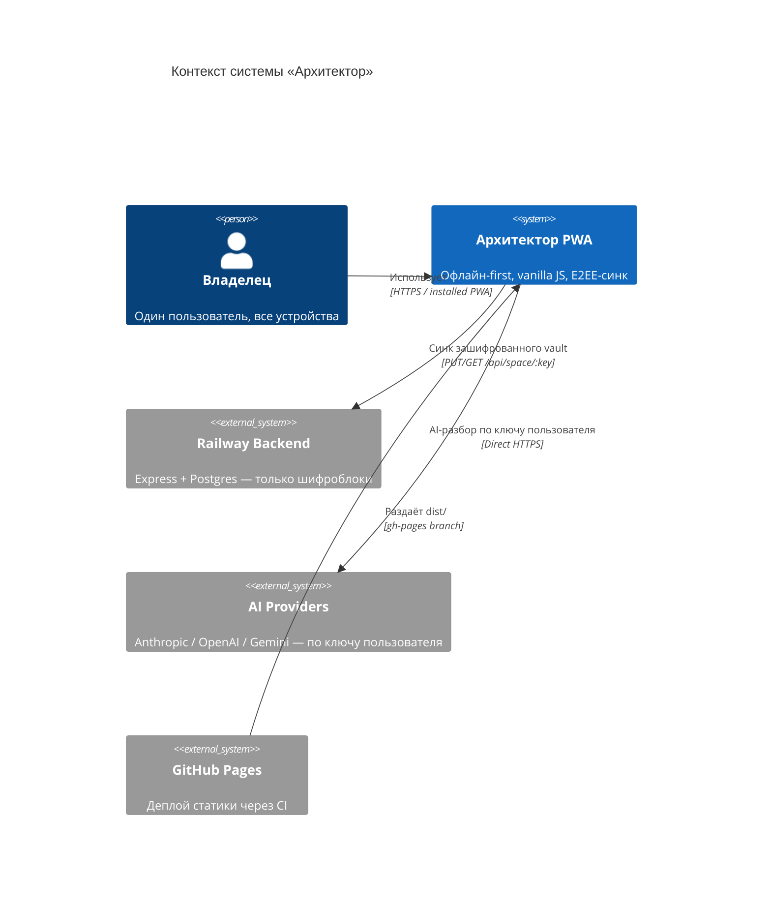

# ADR-0001 — Ванильный JS, один файл на слой, без фреймворков

**Статус:** Принято  
**Дата:** 2026-07-18  
**Автор:** Алекс Романов (системный архитектор)

---

## Контекст

«Архитектор» — офлайн-first PWA для одного пользователя. Нужно работать без
интернета, устанавливаться на домашний экран iOS/Android, обходиться без сервера
для личных данных. Команда — один владелец + несколько AI-сессий; скорость
итерации и предсказуемость важнее абстракций для масштаба.

## Решение

**Один слой — один файл**: `app.js` (вся логика), `styles.css` (дизайн-система),
`index.html` (разметка), `sw.js` (service worker). Сборка `build.mjs` инлайнит
всё в один `dist/app.html` с детерминированной версией по контент-хешу.

Никаких npm-зависимостей в рантайме: иконки — `lucide.js` (самохостинг, pinned
1.23.0), шрифт — `inter-*.woff2` (самохостинг). Тесты — Playwright E2E против
реального браузера, не юнит-моки.

## Последствия

**Плюсы:**
- Деплой = один HTML-файл, CDN не нужен, офлайн работает полностью.
- Обновление кода = новый хеш → новый кэш SW → пользователь получает версию
  без ручного «очистить кеш».
- AI-сессии не разрушают архитектуру случайным `npm install react`.
- E2E-тесты гоняют реальный браузер — нет разрыва между «тестом» и «продом».

**Минусы / ограничения:**
- `app.js` растёт в один файл → его нельзя tree-shaking'нуть без сборки.
  Компромисс: размер приемлем для PWA (gzip < 200 KB), сборка инлайнит.
- Отсутствие TypeScript → документировать контракты через JSDoc и E2E.
- Добавление новой функции = правка одного большого файла, конфликты при
  параллельной работе двух сессий → решается через `STUDIO_HANDOFF.md`.

## Альтернативы (почему не взяты)

| Альтернатива | Причина отказа |
|---|---|
| React/Vue SPA | Build-time зависимости, npm в рантайме, усложняет офлайн-кеш |
| Vite + TypeScript | Оправдан при >1 разработчика; текущий масштаб — один пользователь |
| Next.js / SSR | Нет серверного рантайма для личных данных (E2EE-требование) |
| Web Components | Полифиллы, сложность на iOS Safari < 16 |
