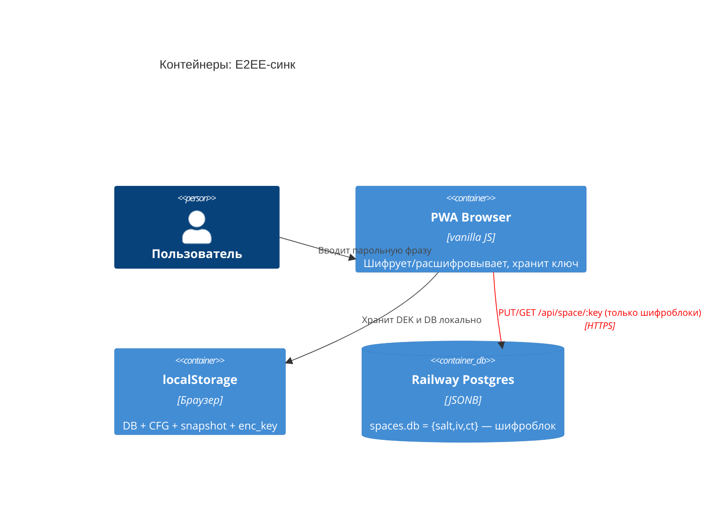

# ADR-0002 — E2EE-синхронизация: шифрование на клиенте, сервер видит только шифроблоки

**Статус:** Принято  
**Дата:** 2026-07-18  
**Автор:** Алекс Романов (системный архитектор)

---

## Контекст

Пользователь ведёт психологический дневник — самые приватные данные жизни.
Требование: кросс-девайс синк без компромисса приватности. Сервер (Railway)
должен физически не иметь возможности прочитать содержимое дневника.



## Решение

### Формат envelope v2 (текущее состояние)

```
Парольная фраза + salt → PBKDF2-SHA256 (600 000 iter) → KEK
Случайный DEK (AES-256) шифрует данные → {ct, iv}
DEK заворачивается KEK → {encDEK, dekIv}
Опционально: DEK заворачивается ключом восстановления → {encDEK_rec, dekIv_rec}
На сервер: { v:2, salt, iv, ct, encDEK, dekIv, encDEK_rec?, dekIv_rec? }
```

**Совместимость:** v1-блоки (100k PBKDF2, DEK не вынесен) читаются автоматически.
Downgrade-guard: попытка записать v1-блок поверх v2 отклоняется.

### Честная граница (AI-слой)

AI-разбор (психоконтур, диалог, сонник) отправляет **выбранный текст в
открытом виде** напрямую браузер → AI-провайдер по ключу пользователя.
Наш сервер этот трафик не видит. Privacy-экран (`ov-privacy`) честно
раскрывает это исключение.

```
Корректный маркетинг-тезис:
«Память end-to-end зашифрована. AI-разбор идёт по твоему ключу,
только по выбранному тексту, и никогда не через наш сервер.»
```

## Последствия

**Плюсы:**
- Разработчик / сервер / GitHub физически не видят содержимое дневника.
- Новое устройство + парольная фраза = полная память.
- Ключ восстановления снимает риск «забыл фразу = потерял всё».

**Минусы / ограничения:**
- Без парольной фразы синк уходит в незашифрованном виде — UI предупреждает.
- Нет «сброса пароля» (это E2EE-инвариант, не баг).
- Шифрование на клиенте: PBKDF2-SHA256, 600k iter — единственный вариант в
  Web Crypto API без WASM-зависимости.

## Что осталось (следующие шаги)

| Задача | Статус |
|---|---|
| Argon2id (WASM) как апгрейд KDF | Запланировано P2 |
| Passkey / WebAuthn PRF как обёртка KEK | Запланировано P2 |
| Пароль пространства (2-й фактор на сервере) | Запланировано P2 |
| Форвардное предупреждение при несифрованном синке | ✅ Сделано |
| Ключ восстановления + флоу «войти по ключу» | ✅ Сделано |

## Альтернативы (почему не взяты)

| Альтернатива | Причина отказа |
|---|---|
| Серверное шифрование (ключ на сервере) | Сервер читает данные — нарушает требование |
| Только localStorage, без синка | Потеря данных при смене/потере устройства |
| Шифрование через Signal Protocol (X3DH/DR) | Избыточен для одного пользователя без peer-to-peer |
| Паролегенерируемый ECDH-ключ без DEK | Нельзя добавить ключ восстановления без перешифровки всего |
