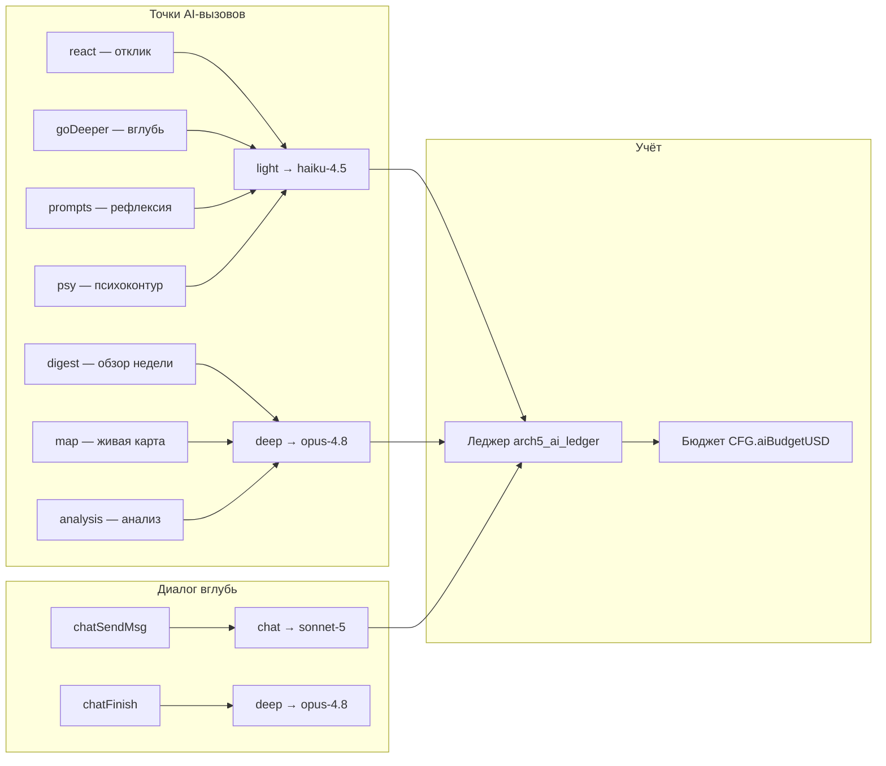

# ADR-0003 — AI-маршрутизация по классу задачи + леджер расходов

**Статус:** Принято  
**Дата:** 2026-07-18  
**Автор:** Алекс Романов (системный архитектор)

---

## Контекст

Приложение вызывает AI в 7 точках с разной ценностью/стоимостью: от лёгких
«откликов» (десятки в день) до «обзоров недели» (редкие, дорогие). Единая
модель на всё — либо дорого (opus везде), либо слабо (haiku везде).
Пользователь не видит, куда уходят деньги.



## Решение

### Маршруты (AI_ROUTES)

```js
AI_ROUTES = {
  light:  ['react', 'deeper', 'prompts', 'psy'],   // haiku-4.5
  deep:   ['digest', 'map', 'analysis'],            // opus-4.8
  chat:   'sonnet-5',                               // промежуточный диалог
  finish: 'opus-4.8',                               // заключение диалога
};
```

Пользователь может переопределить per-класс через Настройки → «Ключи сервисов»
(селекты с ценой). `CFG.aiModel` — fallback.

### Леджер

```js
// Кольцо ≤500 записей в localStorage 'arch5_ai_ledger'
{ ts, task, model, ti, to, costUSD }
// costUSD = (ti * priceIn + to * priceOut) / 1_000_000
```

Прайс-таблица `AI_PRICES` обновляется в конфиге без пересборки.

### Бюджет

- `CFG.aiBudgetUSD = 0` — без ограничений.
- При 80% порога: предупреждение в отклике (раз в день).
- При 100%: `callClaude` бросает `{ budget: true }` — AI-слой тихо
  выключается, локальный движок (`smartInsights`, `correlations`) продолжает.

### Мультипровайдер

```js
AI_PROVIDERS = {
  anthropic: { call(opts) → {text, ti, to} },
  openai:    { call(opts) → {text, ti, to} },
  gemini:    { call(opts) → {text, ti, to} },
};
// Единый интерфейс, разные endpoint/формат ответа
```

Ключи per-провайдер в `aiKeySlot`/`getAiKeyFor`. Личные данные не покидают
устройство иначе как прямым запросом к провайдеру.

## Последствия

**Плюсы:**
- Лёгкие задачи (80% вызовов) → в 10–20× дешевле без потери качества.
- Пользователь видит, куда уходят деньги (разбивка по задачам).
- Бюджетный стоп — защита от неожиданного счёта.

**Минусы / ограничения:**
- Прайс-таблицу нужно обновлять вручную при смене цен провайдера.
- Маршрут — статический конфиг, не динамический (задача определяется в точке
  вызова, не адаптируется к содержимому).

## Что проверено E2E (тесты 56–70 в e2e.mjs)

- `react` → `claude-haiku-4-5`, `digest` → `claude-opus-4-8`.
- Леджер содержит tokensIn при каждом вызове.
- Экран «Расходы AI» показывает разбивку с `$`.
- Исчерпанный бюджет блокирует вызов.
- GPT: endpoint `api.openai.com`, модель `gpt-4o-mini`.
- Gemini: endpoint `generativelanguage.googleapis.com`, deep-модель.

## Альтернативы (почему не взяты)

| Альтернатива | Причина отказа |
|---|---|
| Серверный AI-прокси (с нашим ключом) | Нарушает E2EE: личный контент проходит через наш сервер |
| LangChain / LlamaIndex | Python-зависимость, серверный рантайм |
| Один класс задач (без маршрутизации) | Или дорого, или слабо — нет оптимума |
| Хостовый rate-limiter на провайдере | Провайдер не знает наш бюджет; нужен клиентский контроль |
