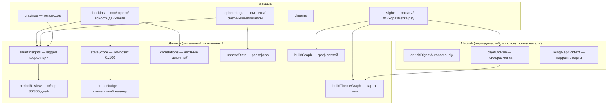

# ADR-0004 — Умный движок: 7 способностей, lagged-корреляции, честность по n

**Статус:** Принято  
**Дата:** 2026-07-18  
**Автор:** Алекс Романов (системный архитектор)

---

## Контекст

Главная боль категории (Bearable, Daylio, Rosebud) — «данные ≠ смысл»: люди
годами трекают, не получая действенной мудрости. Нужен движок, который
превращает личные данные в конкретные выводы — с доказательной базой.



## Решение

### Принцип честности (дифференциатор)

Каждый вывод имеет метку уверенности по количеству данных:

```js
// n < 7  → не показываем корреляцию вообще
// n 7–14 → «наблюдение (7 дней)»
// n ≥ 15 → «устойчивая связь (15+ дней)»
```

Пустые состояния объясняют, **сколько не хватает**:
```
«Ещё 3 чек-ина — и покажу связь сна и ясности»
```

### Lagged-корреляции (Bearable-паттерн)

Эффект фактора измеряется со сдвигом lag=0/+1/+7 дней:
```js
// «Спорт → состояние выше НА СЛЕДУЮЩИЙ день (+12%, lag+1)»
// Формулировка: «Делаешь X → получаешь Y (+N%, через день)»
```

### Прощающая метрика постоянства

Вместо жёсткого стрика (обнуление при пропуске) — плавное затухание:
```
consistency = (hits / max(days, 1)) * decayFactor
```
Мотивация сохраняется после одного пропуска.

### Психоконтур (метод «Зачем?», PSY_CONTOUR.md)

AI размечает записи по схеме: symptom → func → gain → need → ego → emotion →
themes. Разметка — ASCII-коды в JSON-схеме (решение бага enum с кириллицей,
ADR-0005), перевод в русские значения на клиенте.

Смысловая карта строится из `i.psy.themes` (осознанные темы ИИ), не из
повторяемых слов — это принципиальное отличие от TF-IDF-графов.

## Последствия

**Плюсы:**
- Действенные выводы («что помогает») вместо красивых графиков.
- Честность по n не даёт «фейковых» корреляций на малом n.
- Локальный движок работает офлайн, без AI-вызовов, мгновенно.
- AI-слой поверх готовых сигналов — экономно (не перегоняет raw-данные).

**Минусы / ограничения:**
- Статистика малых выборок (личный датасет n=1) шумна — честные метки
  уверенности не решают проблему, а честно её называют.
- Lagged-корреляции — Пирсон по дням, не RM-ANOVA: упрощение, но
  достаточно для личного use-case без серверного ML.

## Что проверено E2E

- `smartInsights` возвращает ≥1 вывод при 20 чек-инах.
- `correlations` считает связи при n≥7.
- `stateScore` в диапазоне [0, 100].
- `periodReview` 30/365 строится без ошибок.
- `sphereStats` читает тип сферы.
- Lagged-паттерн сферы формулируется как «на следующий день».
- Граф тем: не все со всеми, только по редким совместным словам.
- Смысловая карта в режиме `sem=true` — из AI-тем, не из слов.

## Альтернативы (почему не взяты)

| Альтернатива | Причина отказа |
|---|---|
| Серверный ML (XGBoost/Bayesian NN) | Обучается на когорте, n=1 — невалидно; тянет личное на сервер |
| Хостовая вектор-БД (Pinecone/Qdrant) | Избыточна для ~12 методов; личное уходит на сервер |
| Предиктивные уведомления через внешний cron | Нет серверного знания о паттернах пользователя (E2EE) |
| «Просто показывай графики» | Закрывает дыру «данные ≠ смысл» только визуально, не по сути |
